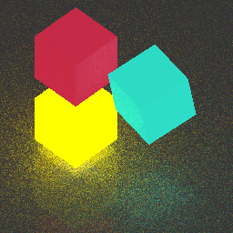

# Lighar

Lighar is a software ray tracing framework that feels just like `VK_NV_ray_tracing`.

Hah, nope! it's just my playground. Feel free to check out. 0v0

## License

This project is licensed under either of

* Apache License, Version 2.0, ([LICENSE-APACHE](LICENSE-APACHE) or http://www.apache.org/licenses/LICENSE-2.0)
* MIT license ([LICENSE-MIT](LICENSE-MIT) or http://opensource.org/licenses/MIT)

at your option.
